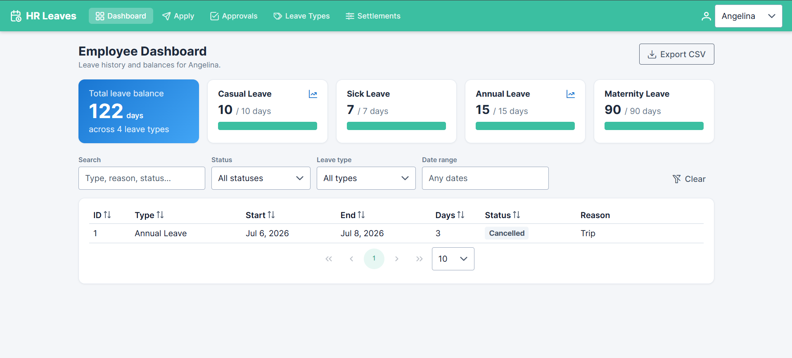
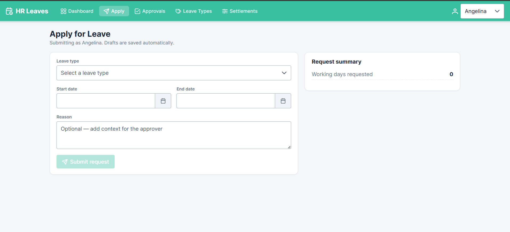
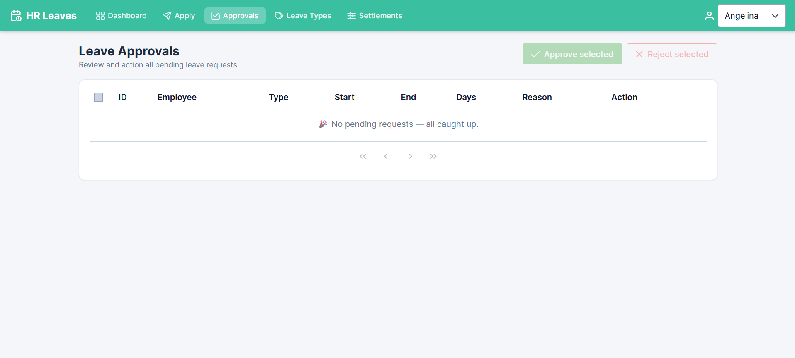
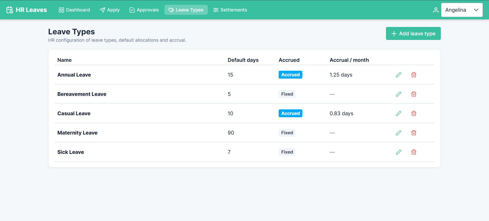
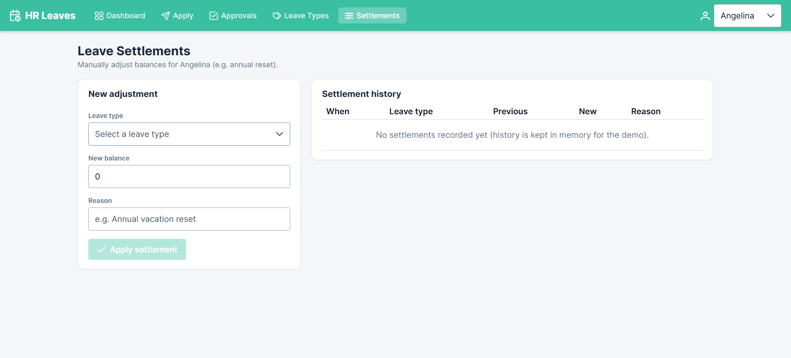

# HR Leaves Management Module

A full-stack HR Leaves Management module built with **ASP.NET Core 8 (code-first, EF Core 8)** and **Angular 21 (standalone components, PrimeNG)**.

It supports leave requests, balances, leave types, approvals, settlements, accrual tracking and a polished dashboard.

---

## Tech stack

| Layer    | Technology                                                        |
| -------- | ----------------------------------------------------------------- |
| Backend  | ASP.NET Core 8 Web API, EF Core 8 (code-first), SQL Server        |
| Frontend | Angular 21 (standalone, zoneless), PrimeNG 21 (Material theme), RxJS |
| Docs     | Swagger / OpenAPI                                                 |

### Solution structure (separation of concerns)

```
Assesment/
├─ Common/               # Cross-cutting enums (LeaveStatus)
├─ DataAccessLayer/      # EF Core: DbContext, Models, Migrations, Repository
├─ BusinessService/      # DTOs, service interfaces + implementations, mapping
├─ HRLeavesManagement/   # Web API: Controllers, Middleware, Program.cs
└─ frontend/             # Angular client
```

The backend follows a layered architecture (Controllers → Services → Repository → DbContext)
with dependency injection and DTOs to keep the API contract decoupled from EF entities.

---

## Prerequisites

- [.NET 8 SDK](https://dotnet.microsoft.com/download) (or .NET 9 SDK — the project targets `net8.0`)
- SQL Server (LocalDB, Express or full) reachable from the connection string
- Node.js 20+ and npm
- EF Core CLI: `dotnet tool install --global dotnet-ef --version 8.*`

---

## Backend setup

1. **Configure the database connection** in `HRLeavesManagement/appsettings.json`:

   ```json
   "ConnectionStrings": {
     "DefaultConnection": "Server=YOUR_SERVER;Database=HRLeavesManagementDb;Trusted_Connection=True;TrustServerCertificate=True;MultipleActiveResultSets=true"
   }
   ```

2. **Apply migrations** (creates the database and seeds demo data):

   ```bash
   dotnet ef database update \
     --project DataAccessLayer/DataAccessLayer.csproj \
     --startup-project HRLeavesManagement/HRLeavesManagement.csproj
   ```

   > The app also calls `Database.Migrate()` on startup, so this runs automatically the first time you launch the API.

3. **Run the API**:

   ```bash
   dotnet run --project HRLeavesManagement/HRLeavesManagement.csproj --launch-profile http
   ```

   - API base URL: **http://localhost:5074/api**
   - Swagger UI: **http://localhost:5074/swagger**

### Seeded demo data

- Employees: `Angelina` (id 1), `Marcus Lee` (id 2)
- Leave types: Casual (10, accrued), Sick (7, fixed), Annual (15, accrued @ 1.25/mo), Maternity (90, fixed)
- A balance row per employee per leave type

---

## Frontend setup

```bash
cd frontend
npm install
ng serve
```

App runs at **http://localhost:4200** (CORS is pre-configured on the API for this origin).

If you change the API port, update `frontend/src/app/core/api.config.ts`.

---

## API overview

| Method | Endpoint                                   | Description                                         |
| ------ | ------------------------------------------ | --------------------------------------------------- |
| GET    | `/api/employees`                           | List employees                                      |
| GET    | `/api/leavetypes`                          | List leave types                                    |
| POST   | `/api/leavetypes`                          | Create a leave type (HR)                            |
| PUT    | `/api/leavetypes/{id}`                     | Update a leave type (HR)                            |
| DELETE | `/api/leavetypes/{id}`                     | Delete an unused leave type (HR)                    |
| GET    | `/api/leavebalances?employeeId=1`          | Balance summary + accrual for an employee           |
| GET    | `/api/leaverequests?employeeId=&status=&leaveTypeId=&fromDate=&toDate=` | Leave history with filters |
| GET    | `/api/leaverequests/pending`               | All pending requests (approval queue)               |
| POST   | `/api/leaverequests`                       | Submit a leave request                              |
| POST   | `/api/leaverequests/{id}/approval`         | Approve / reject a request                          |
| POST   | `/api/leaverequests/bulk-approval`         | Approve / reject many at once                       |
| POST   | `/api/leaverequests/{id}/cancel`           | Cancel a request (restores balance if approved)     |
| POST   | `/api/settlements`                         | Manual balance adjustment                           |
| GET    | `/api/settlements?employeeId=1`            | Settlement history (in-memory)                      |

### Sample requests

**Submit a leave request**

```bash
curl -X POST http://localhost:5074/api/leaverequests \
  -H "Content-Type: application/json" \
  -d '{ "employeeId": 1, "leaveTypeId": 3, "startDate": "2026-07-06", "endDate": "2026-07-08", "reason": "Family trip" }'
```

**Approve a request**

```bash
curl -X POST http://localhost:5074/api/leaverequests/1/approval \
  -H "Content-Type: application/json" \
  -d '{ "status": "Approved" }'
```

**Reject with comment**

```bash
curl -X POST http://localhost:5074/api/leaverequests/1/approval \
  -H "Content-Type: application/json" \
  -d '{ "status": "Rejected", "rejectionComment": "Insufficient coverage that week" }'
```

---

## Feature coverage

**Backend**
- Code-first EF Core 8 with FK constraints, unique indexes and seed data
- Validation: `StartDate <= EndDate`, sufficient balance, no overlapping (pending/approved) requests
- Auto-calculation of `DaysRequested` excluding weekends
- Balance deduction on approval; rollback on cancellation
- Accrual based on `HireDate` + `IsAccrued` (defaults to `DefaultDays / 12`, e.g. 1.25/mo for Annual)
- Custom leave types with configurable defaults (e.g. Maternity 90 days)
- Manual settlements with in-memory history log
- Conflict detection (overlap warning)
- Centralised error handling middleware with meaningful messages
- Swagger documentation with endpoint descriptions and response types

**Frontend**
- Employee dashboard: filterable/sortable request table, summary card, balance widget (progress bars), CSV export
- Apply for leave: reactive form with dropdown/datepickers/textarea, real-time balance validation, **localStorage draft persistence**
- Approvals: pending list with approve/reject + rejection comment, **bulk approve/reject**
- Leave types management (HR): add/edit with `IsAccrued` toggle
- Settlements (HR): manual balance adjustment with history
- Toast notifications, debounced search, responsive Material-styled UI

---

## Notes & assumptions

- **No authentication** — per the brief, single-user access is assumed. An employee selector in the header lets you demo multi-employee scenarios (approvals, HR screens).
- Settlement history is stored **in memory** (per the brief) and resets when the API restarts.
- The brief mentions SQLite in one line but specifies **SQL Server** in the requirements; SQL Server is used. To switch to SQLite, change the provider in `Program.cs` (`UseSqlite`) and the package reference, then regenerate migrations.

- # 📸 Project Screenshots

## Dashboard


## Apply


## Approval


## Leave Type


## Settelments

